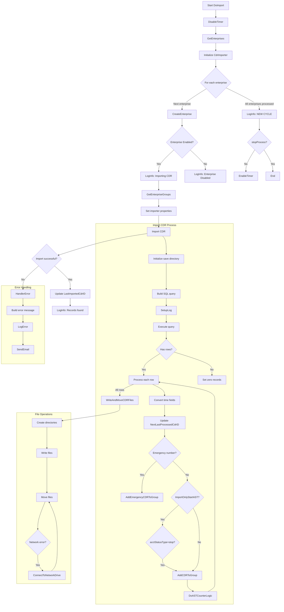

# CDR Import Process Documentation

## Overview
This system imports Call Detail Records (CDRs) from a database for multiple enterprises, processes the records, and distributes them to appropriate destinations based on enterprise and group configurations.

## Main Components

### 1. Core Process (`DoImport` in `CDRImportProcess.cs`)
The main workflow that orchestrates the CDR import cycle for all configured enterprises.

### 2. Supporting Functions
- `GetEnterpriseGroups`: Retrieves group configurations for each enterprise
- `Import`: Handles the actual CDR data retrieval and processing
- `HandlerError`: Centralized error handling and notification
- File operations for writing and moving CDR files

## Workflow Description



## Key Features

1. **Enterprise-Specific Processing**:
   - Handles each enterprise independently
   - Maintains last processed CDR ID per enterprise
   - Supports enterprise-specific configurations

2. **Error Handling**:
   - Comprehensive error logging
   - Email notifications for critical errors
   - Enterprise-specific error tracking

3. **File Operations**:
   - Temporary file staging
   - Secure file transfer to network locations
   - Automatic retry for network issues

4. **Performance Tracking**:
   - Record counters
   - Processing statistics
   - Detailed logging

## Configuration Requirements

### Database Tables
- `ImportCdrEnterprises`: Contains enterprise configurations
  - Fields: EnterpriseID, LastImportedCdrID, MaxRecordsToFetch, Enabled
- `ImportCdrGroups`: Contains group destinations
  - Fields: GroupID, CDRSavePath, CDREmergencySavePath, UserName, Password

### App Settings
- Database connection strings
- Email notification settings
- Timer intervals
- File paths for temporary storage

## Usage Examples

### Starting the Import Process
```csharp
// Initialize and start the import process
var importer = new CDRImportProcess();
importer.Start();
```

### Sample Enterprise Configuration
```sql
INSERT INTO ImportCdrEnterprises 
(EnterpriseID, LastImportedCdrID, MaxRecordsToFetch, Enabled)
VALUES 
('Ent00001', 9301025599, 1000, 1);
```

### Sample Group Configuration
```sql
INSERT INTO ImportCdrGroups
(GroupID, EnterpriseID, CDRSavePath, CDREmergencySavePath, UserName, Password)
VALUES
('709000001', 'Ent00001', 'F:\CDR\Ent00001', F:\CDR\Ent00001', 'user1', 'encryptedpass');
```

## Error Handling

The system provides multiple layers of error handling:

1. **Enterprise-level errors**: Failures for one enterprise don't affect others
2. **Network retries**: Automatic retry for network share access issues
3. **Notification system**: Email alerts for critical failures
