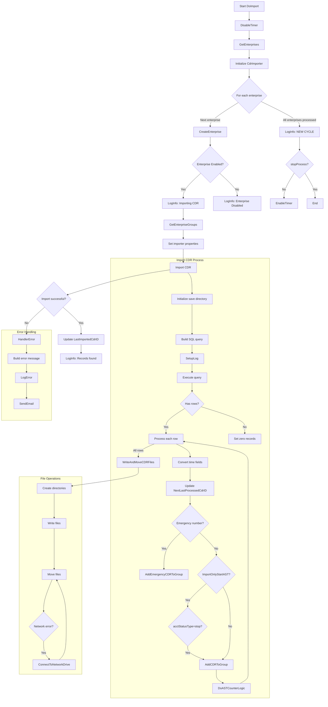

# CDR Import Process Documentation

## Overview
This system imports Call Detail Records (CDRs) from a database for multiple enterprises, processes the records, and distributes them to appropriate destinations based on enterprise and group configurations.

## Main Components

### 1. Core Process (`DoImport` in `CDRImportProcess.cs`)
The main workflow that orchestrates the CDR import cycle for all configured enterprises.

### 2. Supporting Functions
- `GetEnterpriseGroups`: Retrieves group configurations for each enterprise
- `Import`: Handles the actual CDR data retrieval and processing
- `HandlerError`: Centralized error handling and notification
- File operations for writing and moving CDR files

## Workflow Description

## Description Step by Step:

### Flowchart: DoImport Process

#### Start
- **Start**: Timer triggers `OnTimedEvent` in `CDRImportProcess`, which calls `DoImport`.

---

#### DoImport (CDRImportProcess.cs)
1. **Process Start**:
   - **Action**: Disable timer (`aTimer.Enabled = false`).
   - **Action**: Retrieve enterprise list from `Jazz_MiscEntities.ImportCdrEnterprises`.

2. **Decision**: Are there enterprises to process?
   - **Yes**: Proceed to next enterprise.
   - **No**: Go to **End of DoImport**.

3. **For Each Enterprise**:
   - **Action**: Create `Enterprise` object (`EntID`, `LastImportedCdrID`, `MaxRecordsToFetch`).
   - **Decision**: Is enterprise enabled (`ent.Enabled == true`)?
     - **No**:
       - **Action**: Log "Import CDR for EnterpriseID is DISABLED".
       - **Next**: Move to next enterprise.
     - **Yes**:
       - **Action**: Call `GetEnterpriseGroups` to populate `Enterprise.Groups`.
       - **Action**: Create `CdrImporter` instance with `CDRConfiguration`.
       - **Action**: Set `importer.Enterprise` and `importer.AstCounter`.
       - **Try Block**:
         - **Action**: Call `CdrImporter.Import`.
         - **Decision**: Is `importer.NextLastProcessedCdrID > 0`?
           - **Yes**:
             - **Action**: Update `ent.LastImportedCdrID` and `ent.LastUpdatedTime`.
             - **Action**: Save changes to database (`Context.SaveChanges`).
           - **No**: Skip update.
         - **Action**: Log record count (`importer.RecCnt`) and completion.
       - **Catch Block**:
         - **Action**: Call `HandlerError` with exception and `EntID`.
       - **Next**: Move to next enterprise.

4. **Catch Global Exception**:
   - **Action**: Call `HandlerError` with exception and `EntID = "0"`.

5. **End of DoImport**:
   - **Action**: Log "NEW CYCLE" and `stopProcess` flag.
   - **Decision**: Is `stopProcess` true?
     - **Yes**: Keep timer disabled.
     - **No**: Re-enable timer (`aTimer.Enabled = true`).
   - **End**: Return to waiting for next timer event.

---

#### CdrImporter.Import (CdrImporter.cs)
1. **Process Start**:
   - **Action**: Initialize `tmpSaveDirWithEnt` (`tmpSaveFolder + EntID`).
   - **Action**: Construct SQL query (`SELECT * FROM SDDCDR.<EntID> WHERE bwascdr_id > <LastImportedCdrID> LIMIT 0, <MaxRecordsToFetch>`).
   - **Action**: Call `SetupLog` to configure enterprise-specific log.

2. **Database Connection**:
   - **Action**: Open MySQL connection using `ConnString`.
   - **Action**: Execute query with `MySqlCommand`.

3. **Process Records**:
   - **Decision**: Are there records (`dr.HasRows`)?
     - **No**:
       - **Action**: Set `NextLastProcessedCdrID = 0`, `RecCnt = 0`.
       - **Action**: Log "No records found".
       - **Go to**: Write and move files.
     - **Yes**:
       - **For Each Record**:
         - **Action**: Initialize `StringBuilder` for `currentCDR`.
         - **Action**: Extract `userTimeZone`, `calledNumber`, `acctStatusType`, `groupId`.
         - **For Each Field**:
           - **Decision**: Is field a date field (`startTime`, `releaseTime`, etc.)?
             - **Yes**: Convert to local time using `ConvertToLocalTime`.
             - **No**: Use field value as is.
           - **Action**: Append field to `currentCDR` with `Separator`.
         - **Action**: Update `NextLastProcessedCdrID` to `bwascdr_id`.
         - **Decision**: Is `calledNumber` in `lstEmergencyNumbersToCheck`?
           - **Yes**:
             - **Action**: Log emergency CDR.
             - **Action**: Call `AddEmergencyCDRToGroup(groupId, currentCDR)`.
           - **No**:
             - **Decision**: Is `ImportOnlyStartAST` true?
               - **Yes**:
                 - **Decision**: Is `acctStatusType` = "stop"?
                   - **Yes**: Call `AddCDRToGroup(groupId, currentCDR)`.
                   - **No**: Skip.
               - **No**: Call `AddCDRToGroup(groupId, currentCDR)`.
         - **Action**: Call `DoASTCounterLogic(acctStatusType)` to update counters.
         - **Action**: Increment `RecCnt`.
       - **Action**: Log total records (`RecCnt`) and `NextLastProcessedCdrID`.

4. **Write and Move Files**:
   - **Action**: Call `WriteAndMoveCDRFilesToDestination`.
     - **For Each Group in `Enterprise.Groups`**:
       - **Action**: Create directories (`<tmpSaveDirWithEnt>\<GroupID>`, `<tmpSaveDirWithEnt>\<GroupID>\Emergency`).
       - **Decision**: Does `dictCDRByGroup` contain `GroupID`?
         - **Yes**:
           - **Action**: Write CDRs to file (`CDR-<timestamp>`).
         - **No**: Skip.
       - **Decision**: Does `dictCDREmergencyByGroup` contain `GroupID`?
         - **Yes**:
           - **Action**: Write emergency CDRs to file (`CDR-Emergency-<timestamp>`).
         - **No**: Skip.
       - **Action**: Move regular CDR files to `CDRSavePath` via `MoveCDRFile`.
       - **Action**: Move emergency CDR files to `CDREmergencySavePath` via `MoveCDRFile`.

5. **MoveCDRFile Logic**:
   - **Action**: Set `retry = false`.
   - **Try Block**:
     - **Action**: Create destination directory if it doesn’t exist.
     - **Decision**: Does destination file exist?
       - **Yes**: Move with alternate name (`<filename>2`).
       - **No**: Move with original name (`<filename>.csv`).
     - **Action**: Set `retry = false`.
   - **Catch Block**:
     - **Decision**: Is error due to authentication or access, and `retry` is false?
       - **Yes**:
         - **Action**: Call `IOUtils.ConnectToNetworkDrive` with credentials.
         - **Decision**: Connection successful (`ret == 0`)?
           - **Yes**: Set `retry = true`, retry move.
           - **No**: Log error, throw exception.
       - **No**: Log error, throw exception.

6. **End of Import**:
   - **Action**: Log completion.
   - **Return**: Control to `DoImport`.

